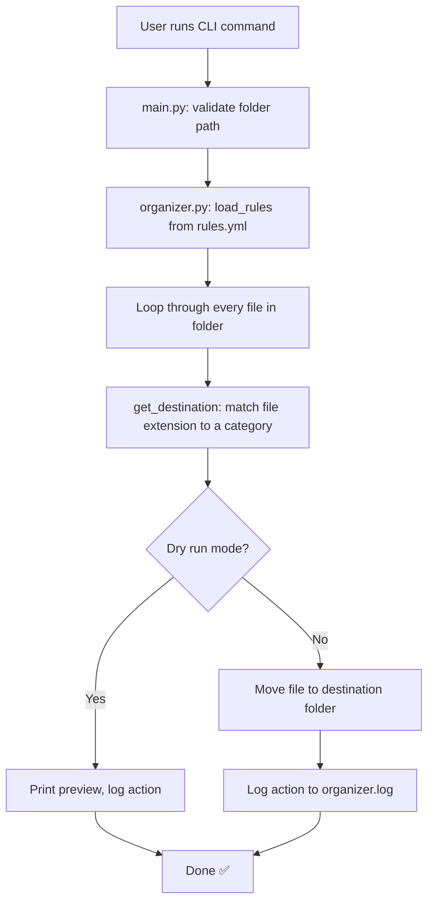

# 📁 Smart File Organizer CLI

A simple, beginner-friendly command-line tool that automatically organizes messy folders by sorting files into categorized subfolders based on file type — built with Python, Typer, and YAML.

## ✨ Features

- 🗂️ Automatically sorts files into folders like `Documents/`, `Images/`, `Finance/`, `Archives/`
- ⚙️ Fully customizable rules via a simple YAML config file
- 🧪 Safe **dry-run mode** to preview changes before anything moves
- 📝 Logging — every action is recorded in `organizer.log`
- 💻 Clean CLI built with [Typer](https://typer.tiangolo.com/)

## 📸 Example

**Before:**
messy_folder/

├── invoice.pdf

├── photo.png

├── notes.txt

├── budget.xlsx

└── archive.zip

**After running the tool:**
messy_folder/

├── Documents/

│   ├── invoice.pdf

│   └── notes.txt

├── Images/

│   └── photo.png

├── Finance/

│   └── budget.xlsx

└── Archives/

└── archive.zip

## 🧠 How It Works



## 🚀 Installation

```bash
git clone https://github.com/rohansirohi/smart-file-organizer.git
cd smart-file-organizer
pip install -r requirements.txt
```

## 🛠️ Usage

```bash
python main.py path/to/your/folder
```

**Preview changes without moving anything (dry run):**
```bash
python main.py path/to/your/folder --dry-run
```

**Use a custom rules file:**
```bash
python main.py path/to/your/folder --config configs/my_rules.yml
```

## ⚙️ Configuration

Customize `configs/rules.yml` to control which file extensions go into which folders:

```yaml
folders:
  Images:
    - .png
    - .jpg
  Documents:
    - .pdf
    - .txt
```

## 🧪 Running Tests

```bash
pytest tests/
```

## 🗺️ Roadmap

- [ ] Duplicate file detection
- [ ] Undo log (reverse the last organize action)
- [ ] Watch mode (auto-organize new files as they appear)

## 🧰 Built With

- Python
- [Typer](https://typer.tiangolo.com/) — CLI framework
- PyYAML — config file parsing
- pytest — testing

## 📄 License

MIT License — free to use and modify.